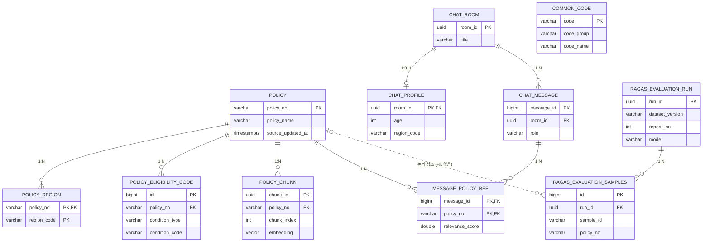

# Schema

## ERD

| 관계 | 카디널리티 | 키 |
|---|---|---|
| policy → policy_region | 1:N | policy_no |
| policy → policy_eligibility_code | 1:N | policy_no |
| policy → policy_chunk | 1:N | policy_no |
| policy ↔ chat_message | N:M (message_policy_ref) | policy_no, message_id |
| chat_room → chat_profile | 1:0..1 | room_id |
| chat_room → chat_message | 1:N | room_id |
| ragas_evaluation_run → ragas_evaluation_samples | 1:N | run_id |
| policy → ragas_evaluation_samples | 1:N (FK 없음) | policy_no |
| common_code | 관계 없음 (FK 없음) | - |

## common_code

| 컬럼 | 타입 | NULL | 기본값 | 제약 |
|---|---|---|---|---|
| code | VARCHAR(30) | NOT NULL | | PK |
| code_group | VARCHAR(50) | NOT NULL | | |
| code_name | VARCHAR(100) | NOT NULL | | |

## policy

| 컬럼 | 타입 | NULL | 기본값 | 제약 |
|---|---|---|---|---|
| policy_no | VARCHAR(30) | NOT NULL | | PK |
| policy_name | VARCHAR(300) | NOT NULL | | |
| description | TEXT | NULL | | |
| support_content | TEXT | NULL | | |
| keywords | TEXT[] | NOT NULL | '{}' | |
| large_categories | TEXT[] | NOT NULL | '{}' | |
| middle_categories | TEXT[] | NOT NULL | '{}' | |
| provider_group_code | VARCHAR(30) | NULL | | |
| provision_method_code | VARCHAR(30) | NULL | | |
| approval_status_code | VARCHAR(30) | NULL | | |
| supervising_org_code | VARCHAR(30) | NULL | | |
| supervising_org_name | VARCHAR(200) | NULL | | |
| supervising_manager_name | VARCHAR(100) | NULL | | |
| operating_org_code | VARCHAR(30) | NULL | | |
| operating_org_name | VARCHAR(200) | NULL | | |
| operating_manager_name | VARCHAR(100) | NULL | | |
| support_scale_limit | BOOLEAN | NULL | | |
| support_scale_count | INTEGER | NULL | | |
| first_come_first_served | BOOLEAN | NULL | | |
| min_age | INTEGER | NULL | | CHECK min_age <= max_age |
| max_age | INTEGER | NULL | | |
| age_limit_yn | BOOLEAN | NULL | | |
| marriage_status_code | VARCHAR(30) | NULL | | |
| income_condition_code | VARCHAR(30) | NULL | | |
| min_income | BIGINT | NULL | | CHECK min_income <= max_income |
| max_income | BIGINT | NULL | | |
| income_etc | TEXT | NULL | | |
| application_period_type_code | VARCHAR(30) | NULL | | |
| application_start_date | DATE | NULL | | CHECK start <= end |
| application_end_date | DATE | NULL | | |
| application_period_raw | TEXT | NULL | | |
| business_period_type_code | VARCHAR(30) | NULL | | |
| business_start_date | DATE | NULL | | CHECK start <= end |
| business_end_date | DATE | NULL | | |
| business_period_etc | TEXT | NULL | | |
| application_method | TEXT | NULL | | |
| screening_method | TEXT | NULL | | |
| submission_documents | TEXT | NULL | | |
| additional_notes | TEXT | NULL | | |
| additional_qualification | TEXT | NULL | | |
| participation_exclusion | TEXT | NULL | | |
| application_url | TEXT | NULL | | |
| reference_url_1 | TEXT | NULL | | |
| reference_url_2 | TEXT | NULL | | |
| registrar_org_code | VARCHAR(30) | NULL | | |
| registrar_org_name | VARCHAR(200) | NULL | | |
| source_created_at | TIMESTAMPTZ | NULL | | |
| source_updated_at | TIMESTAMPTZ | NULL | | |
| synced_at | TIMESTAMPTZ | NOT NULL | NOW() | |
| raw_data | JSONB | NOT NULL | '{}'::jsonb | |

## policy_region

| 컬럼 | 타입 | NULL | 기본값 | 제약 |
|---|---|---|---|---|
| policy_no | VARCHAR(30) | NOT NULL | | PK, FK → policy.policy_no (CASCADE) |
| region_code | VARCHAR(20) | NOT NULL | | PK |

## policy_eligibility_code

| 컬럼 | 타입 | NULL | 기본값 | 제약 |
|---|---|---|---|---|
| id | BIGSERIAL | NOT NULL | | PK |
| policy_no | VARCHAR(30) | NOT NULL | | FK → policy.policy_no (CASCADE), UNIQUE(policy_no, condition_type, condition_code) |
| condition_type | VARCHAR(20) | NOT NULL | | CHECK IN ('MAJOR', 'JOB', 'SCHOOL', 'SPECIAL') |
| condition_code | VARCHAR(30) | NOT NULL | | |

## policy_chunk

| 컬럼 | 타입 | NULL | 기본값 | 제약 |
|---|---|---|---|---|
| chunk_id | UUID | NOT NULL | gen_random_uuid() | PK |
| policy_no | VARCHAR(30) | NOT NULL | | FK → policy.policy_no (CASCADE), UNIQUE(policy_no, chunk_index) |
| chunk_index | INTEGER | NOT NULL | | CHECK >= 0 |
| chunk_type | VARCHAR(30) | NOT NULL | | |
| content | TEXT | NOT NULL | | |
| embedding | VECTOR(1536) | NULL | | |
| embedding_model | VARCHAR(100) | NOT NULL | 'text-embedding-3-small' | |
| created_at | TIMESTAMPTZ | NOT NULL | NOW() | |

## chat_room

| 컬럼 | 타입 | NULL | 기본값 | 제약 |
|---|---|---|---|---|
| room_id | UUID | NOT NULL | gen_random_uuid() | PK |
| title | VARCHAR(200) | NULL | | |
| created_at | TIMESTAMPTZ | NOT NULL | NOW() | |
| updated_at | TIMESTAMPTZ | NOT NULL | NOW() | |

## chat_profile

| 컬럼 | 타입 | NULL | 기본값 | 제약 |
|---|---|---|---|---|
| room_id | UUID | NOT NULL | | PK, FK → chat_room.room_id (CASCADE) |
| age | INTEGER | NULL | | CHECK >= 0 |
| gender | VARCHAR(20) | NULL | | |
| region_code | VARCHAR(20) | NULL | | |
| marriage_status_code | VARCHAR(30) | NULL | | |
| annual_income | BIGINT | NULL | | CHECK >= 0 |
| major_code | VARCHAR(30) | NULL | | |
| job_code | VARCHAR(30) | NULL | | |
| school_code | VARCHAR(30) | NULL | | |
| special_target_code | VARCHAR(30) | NULL | | |
| extra_profile | JSONB | NOT NULL | '{}'::jsonb | |
| updated_at | TIMESTAMPTZ | NOT NULL | NOW() | |

## chat_message

| 컬럼 | 타입 | NULL | 기본값 | 제약 |
|---|---|---|---|---|
| message_id | BIGSERIAL | NOT NULL | | PK |
| room_id | UUID | NOT NULL | | FK → chat_room.room_id (CASCADE) |
| role | VARCHAR(20) | NOT NULL | | CHECK IN ('user', 'assistant', 'system', 'tool') |
| content | TEXT | NOT NULL | | |
| created_at | TIMESTAMPTZ | NOT NULL | NOW() | |

## message_policy_ref

| 컬럼 | 타입 | NULL | 기본값 | 제약 |
|---|---|---|---|---|
| message_id | BIGINT | NOT NULL | | PK, FK → chat_message.message_id (CASCADE) |
| policy_no | VARCHAR(30) | NOT NULL | | PK, FK → policy.policy_no (CASCADE) |
| relevance_score | DOUBLE PRECISION | NULL | | CHECK -1.0 ~ 1.0 |

## ragas_evaluation_run

| 컬럼 | 타입 | NULL | 기본값 | 제약 |
|---|---|---|---|---|
| run_id | UUID | NOT NULL | gen_random_uuid() | PK |
| dataset_version | VARCHAR(50) | NOT NULL | | |
| repeat_no | INTEGER | NOT NULL | 1 | CHECK >= 1 |
| mode | VARCHAR(20) | NOT NULL | 'rag' | CHECK IN ('rag', 'baseline', 'offline') |
| rag_chat_model | VARCHAR(100) | NULL | | |
| rag_retriever | VARCHAR(50) | NULL | | |
| rag_top_k | INTEGER | NULL | | |
| judge_model | VARCHAR(100) | NOT NULL | | |
| embedding_model | VARCHAR(100) | NOT NULL | | |
| status | VARCHAR(20) | NOT NULL | 'RUNNING' | CHECK IN ('RUNNING', 'SUCCEEDED', 'FAILED') |
| sample_count | INTEGER | NULL | | |
| avg_context_precision | NUMERIC(4,3) | NULL | | |
| avg_context_recall | NUMERIC(4,3) | NULL | | |
| avg_faithfulness | NUMERIC(4,3) | NULL | | |
| avg_answer_relevancy | NUMERIC(4,3) | NULL | | |
| avg_factual_correctness | NUMERIC(4,3) | NULL | | |
| avg_reference_faithfulness | NUMERIC(4,3) | NULL | | |
| started_at | TIMESTAMPTZ | NOT NULL | NOW() | |
| finished_at | TIMESTAMPTZ | NULL | | |
| metadata | JSONB | NOT NULL | '{}'::jsonb | |

## ragas_evaluation_samples

| 컬럼 | 타입 | NULL | 기본값 | 제약 |
|---|---|---|---|---|
| id | BIGSERIAL | NOT NULL | | PK |
| run_id | UUID | NOT NULL | | FK → ragas_evaluation_run.run_id (CASCADE), UNIQUE(run_id, sample_id) |
| sample_id | VARCHAR(50) | NOT NULL | | |
| policy_no | VARCHAR(30) | NULL | | |
| question | TEXT | NOT NULL | | |
| answer | TEXT | NULL | | |
| ground_truth | TEXT | NULL | | |
| contexts | JSONB | NOT NULL | '[]'::jsonb | |
| context_precision | NUMERIC(4,3) | NULL | | CHECK 0 ~ 1 |
| context_recall | NUMERIC(4,3) | NULL | | CHECK 0 ~ 1 |
| faithfulness | NUMERIC(4,3) | NULL | | CHECK 0 ~ 1 |
| answer_relevancy | NUMERIC(4,3) | NULL | | CHECK 0 ~ 1 |
| factual_correctness | NUMERIC(4,3) | NULL | | CHECK 0 ~ 1 |
| reference_faithfulness | NUMERIC(4,3) | NULL | | CHECK 0 ~ 1 |
| latency_ms | INTEGER | NULL | | |
| created_at | TIMESTAMPTZ | NOT NULL | NOW() | |
| metadata | JSONB | NOT NULL | '{}'::jsonb | |

## 인덱스

| 테이블 | 인덱스 | 컬럼 | 방식 |
|---|---|---|---|
| common_code | idx_common_code_group | code_group | B-tree |
| policy | idx_policy_name | policy_name | B-tree |
| policy | idx_policy_age | min_age, max_age | B-tree |
| policy | idx_policy_marriage_status | marriage_status_code | B-tree |
| policy | idx_policy_application_period | application_start_date, application_end_date | B-tree |
| policy | idx_policy_source_updated_at | source_updated_at | B-tree |
| policy | idx_policy_keywords_gin | keywords | GIN |
| policy | idx_policy_large_categories_gin | large_categories | GIN |
| policy | idx_policy_middle_categories_gin | middle_categories | GIN |
| policy_region | idx_policy_region_region_code | region_code | B-tree |
| policy_eligibility_code | idx_policy_eligibility_lookup | condition_type, condition_code | B-tree |
| policy_eligibility_code | idx_policy_eligibility_policy | policy_no | B-tree |
| policy_chunk | idx_policy_chunk_policy_no | policy_no | B-tree |
| policy_chunk | idx_policy_chunk_type | chunk_type | B-tree |
| policy_chunk | idx_policy_chunk_embedding_hnsw | embedding (vector_cosine_ops, WHERE embedding IS NOT NULL) | HNSW |
| chat_profile | idx_chat_profile_region_code | region_code | B-tree |
| chat_message | idx_chat_message_room_created | room_id, created_at | B-tree |
| message_policy_ref | idx_message_policy_ref_policy | policy_no | B-tree |
| ragas_evaluation_run | idx_ragas_run_started | started_at | B-tree |
| ragas_evaluation_run | idx_ragas_run_mode | mode, dataset_version | B-tree |
| ragas_evaluation_samples | idx_ragas_samples_run | run_id | B-tree |
| ragas_evaluation_samples | idx_ragas_samples_policy | policy_no | B-tree |
